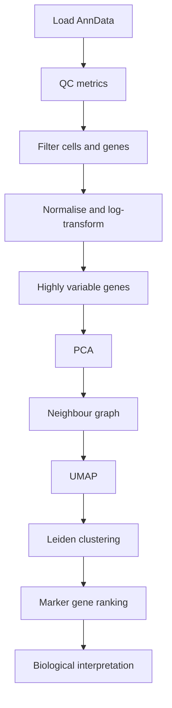

# single-cell-clustering-analysis

A notebook-based single-cell RNA-seq analysis project using Scanpy and AnnData. The workflow demonstrates quality control, preprocessing, dimensionality reduction, clustering, marker gene ranking, and early-stage biological interpretation.

## Overview

This project uses the PBMC3k dataset to demonstrate a standard single-cell analysis workflow. It is designed as a learning and portfolio project, with emphasis on understanding each analytical step rather than treating the workflow as a black box.

## Workflow

## Notebooks

- `01_qc_preprocessing.ipynb` — quality control, filtering, normalisation
- `02_clustering_marker_genes.ipynb` — HVGs, PCA, UMAP, Leiden clustering, marker genes
- `03_annotation_interpretation.ipynb` — marker inspection and early-stage biological interpretation

## Key concepts

- AnnData object structure
- Scanpy preprocessing workflows
- QC metrics and filtering logic
- Highly variable gene selection
- PCA, neighbour graphs, UMAP, and Leiden clustering
- Marker gene ranking using rank_genes_groups
- Conservative biological annotation based on marker evidence

## Notes

Cluster annotation is intentionally marked as work in progress where marker evidence is ambiguous.

## Requirements

`pip install -r requirements.txt`

## Run

Open the notebooks in order using the project virtual environment.